# 🐞 智能害虫识别系统 

[] [] [] []

🔍 **智能识别农业害虫** • 🚀 **高效数据分析** • 🌐 **RESTful API服务**


 

## 📍 目录导航

🔹 [核心功能](#-核心功能)  
🔹 [技术架构](#-技术架构)  
🔹 [快速启动](#-快速启动)  
🔹 [开发指南](#-开发指南)  
🔹 [API文档](#-api文档)  
🔹 [贡献说明](#-贡献说明)  
🔹 [联系我们](#-联系我们)

## 🌟 核心功能

<div align="center">

| 🎯 功能模块      | 🛠️ 技术实现        | 📸 可视化示例 |
|----------------|-------------------|--------------|
| 🖼️ **图像识别**  | TensorFlow+Keras  |  |
| 📊 **数据分析**  | Spring Data JPA   |  |
| 🌐 **API服务**   | RESTful API       |  |
| 📱 **移动适配**  | 响应式设计         |  |

</div>

## 🛠️ 技术架构

### 后端技术栈

<div align="center">

 
 
 


</div>

### 前端技术栈

<div align="center">

 
 
 


</div>

## 🚀 快速启动

```bash
# 1. 克隆仓库
git clone https://github.com/yourrepo/pest-recognition.git

# 2. 后端启动
cd pest-recognition-backend
mvn clean install
mvn spring-boot:run

# 3. 前端启动 (新终端)
cd ../pest-recognition-frontend
npm install
npm run serve

# 访问地址
http://localhost:8080 (后端API)
http://localhost:8081 (前端界面)
```

> 💡 提示：确保已安装 [JDK 17+](https://adoptium.net/) 和 [Node.js 16+](https://nodejs.org/)

## 👨💻 开发指南

### 分支策略

```mermaid
gitGraph
  commit
  branch dev
  checkout dev
  commit
  branch feature/新功能
  commit
  checkout dev
  merge feature/新功能
  checkout main
  merge dev
```



- 🌿 `main` 生产分支 (受保护)
- 🚧 `dev` 开发分支
- ✨ `feature/*` 功能分支
- 🐛 `hotfix/*` 紧急修复

### 代码规范

✅ 使用 [ESLint](https://eslint.org/) + [Prettier](https://prettier.io/) 规范前端代码  
✅ 使用 [Checkstyle](https://checkstyle.sourceforge.io/) 规范后端代码

## 🤝 贡献说明

🙌 我们欢迎所有形式的贡献！请遵循以下流程：

1. 🍴 Fork本仓库
2. 🌱 创建特性分支 (`git checkout -b feature/你的功能`)
3. 💾 提交修改 (`git commit -m '添加: 你的功能'`)
4. 🚀 推送分支 (`git push origin feature/你的功能`)
5. 🔄 创建Pull Request

📌 请确保：
- 代码符合项目规范
- 包含必要的单元测试
- 更新相关文档

🎉 你的名字将出现在 [贡献者名单](#贡献者) 中！

## 📜 许可证

[MIT License](LICENSE) © 2023 智能害虫识别系统团队

## 🌟 贡献者

<a href="https://github.com/yourrepo/pest-recognition/graphs/contributors">
  
</a>

## 📞 联系我们

📧 Email: contact@pest-recognition.com  
💬 Slack: [加入我们的工作区](https://slack.pest-recognition.com)  
🐦 Twitter: [@PestRecognition](https://twitter.com/PestRecognition)
