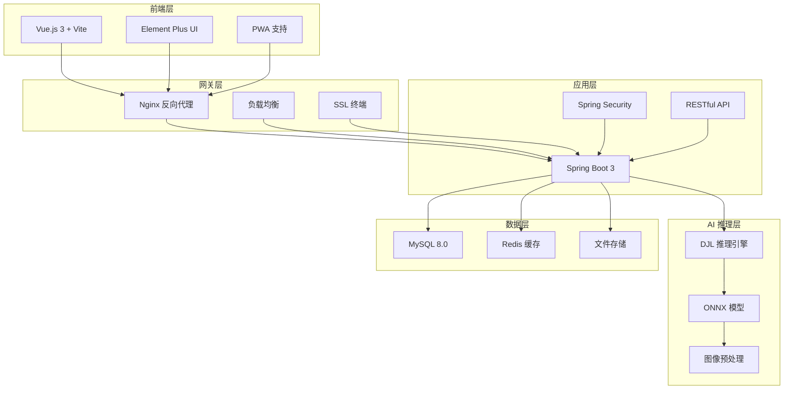

# 🌾 AgriVision AI

> 基于深度学习的智能农业害虫识别与防治建议平台

**AgriVision AI** 是一个现代化的智能农业解决方案，利用先进的计算机视觉和深度学习技术，为农业从业者提供精准的害虫识别服务和专业的防治指导。

[](https://vuejs.org/)
[](https://spring.io/projects/spring-boot)
[](https://www.oracle.com/java/)
[](https://www.mysql.com/)
[](https://djl.ai/)

## 📖 项目简介

**AgriVision AI** 是新一代智能农业害虫识别平台，融合了最新的人工智能技术和农业专业知识。通过简单的图片上传，农民和农业专家可以在几秒钟内获得准确的害虫识别结果和个性化的防治方案，助力现代农业的数字化转型。

### ✨ 核心特性

#### 🤖 AI智能识别
- **🧠 深度学习引擎**: 基于最新CNN架构的害虫识别模型
- **🎯 高精度识别**: 支持50+种常见农业害虫，识别准确率>95%
- **⚡ 毫秒级响应**: 优化推理引擎，平均识别时间<500ms
- **📸 多格式支持**: JPG、PNG、WebP等主流图片格式

#### 🌱 智慧农业解决方案
- **📋 个性化防治**: 基于害虫种类、作物类型、地区气候的定制化方案
- **💊 精准用药指导**: AI推荐最适合的农药配比和施用方法
- **📅 防治时机**: 智能分析最佳防治时间窗口
- **🔄 全程跟踪**: 从识别到防治效果的完整记录

#### 🎨 现代化用户体验
- **📱 响应式设计**: 完美适配PC、平板、手机等所有设备
- **🎯 一键识别**: 拖拽上传或拍照即可，操作极简
- **📊 可视化报告**: 图表化展示识别结果和防治建议
- **🌙 深色模式**: 支持明暗主题切换

#### 🏗️ 企业级架构
- **☁️ 云原生设计**: Docker容器化，支持K8s部署
- **🔄 微服务架构**: 前后端分离，API优先设计
- **🛡️ 安全可靠**: JWT认证、数据加密、SQL注入防护
- **📈 高性能**: Redis缓存、数据库优化、CDN加速
- **🔧 易于扩展**: 插件化设计，支持自定义模型集成

## 🏗️ 系统架构

AgriVision AI 采用云原生微服务架构，具备高可用、高性能、易扩展的特点：



### 🔧 技术栈详情

| 层级 | 技术选型 | 版本 | 说明 |
|------|----------|------|------|
| **前端** | Vue.js | 3.3+ | 渐进式框架 |
| | Element Plus | 2.4+ | UI组件库 |
| | Vite | 4.0+ | 构建工具 |
| **后端** | Spring Boot | 3.1+ | 微服务框架 |
| | Spring Security | 6.1+ | 安全框架 |
| | MyBatis Plus | 3.5+ | ORM框架 |
| **AI引擎** | DJL | 0.24+ | 深度学习库 |
| | ONNX Runtime | 1.16+ | 推理引擎 |
| **数据库** | MySQL | 8.0+ | 关系型数据库 |
| | Redis | 7.0+ | 内存缓存 |
| **部署** | Docker | 24.0+ | 容器化 |
| | Nginx | 1.24+ | Web服务器 |

## 📁 项目结构

```
agrivision-ai/
├── 📁 pest-recognition-backend/           # 🚀 Spring Boot 后端服务
│   ├── 📁 src/main/java/com/agrivision/
│   │   ├── 📁 controller/                 # 🎮 REST API 控制器
│   │   │   ├── PestController.java        # 害虫识别接口
│   │   │   ├── UserController.java        # 用户管理接口
│   │   │   └── FileController.java        # 文件上传接口
│   │   ├── 📁 service/                    # 🔧 业务逻辑层
│   │   │   ├── PestRecognitionService.java # AI识别服务
│   │   │   ├── TreatmentService.java      # 防治建议服务
│   │   │   └── UserService.java           # 用户服务
│   │   ├── 📁 entity/                     # 📊 数据实体
│   │   ├── 📁 mapper/                     # 🗄️ 数据访问层
│   │   ├── 📁 config/                     # ⚙️ 配置类
│   │   │   ├── SecurityConfig.java        # 安全配置
│   │   │   ├── SwaggerConfig.java         # API文档配置
│   │   │   └── AIModelConfig.java         # AI模型配置
│   │   └── 📁 ai/                         # 🤖 AI推理模块
│   │       ├── ModelLoader.java           # 模型加载器
│   │       └── ImageProcessor.java        # 图像预处理
│   ├── 📁 src/main/resources/
│   │   ├── application.properties         # 应用配置
│   │   ├── application.properties.example # 配置模板
│   │   └── 📁 mapper/                     # MyBatis映射
│   ├── 📁 models/                         # 🧠 AI模型文件
│   ├── Dockerfile                         # 🐳 容器配置
│   ├── docker-entrypoint.sh              # 启动脚本
│   └── pom.xml                            # Maven依赖
├── 📁 pest-recognition-frontend/          # 🎨 Vue.js 前端应用
│   ├── 📁 src/
│   │   ├── 📁 components/                 # 🧩 可复用组件
│   │   │   ├── PestUpload.vue             # 图片上传组件
│   │   │   ├── ResultDisplay.vue          # 结果展示组件
│   │   │   └── TreatmentCard.vue          # 防治建议卡片
│   │   ├── 📁 views/                      # 📄 页面组件
│   │   │   ├── Home.vue                   # 首页
│   │   │   ├── Recognition.vue            # 识别页面
│   │   │   └── History.vue                # 历史记录
│   │   ├── 📁 router/                     # 🛣️ 路由配置
│   │   ├── 📁 store/                      # 📦 状态管理(Pinia)
│   │   ├── 📁 utils/                      # 🔧 工具函数
│   │   └── 📁 assets/                     # 🖼️ 静态资源
│   ├── 📁 public/                         # 🌐 公共资源
│   ├── Dockerfile                         # 🐳 容器配置
│   ├── nginx.conf                         # Nginx配置
│   ├── package.json                       # npm依赖
│   └── vite.config.js                     # Vite配置
├── 📁 docs/                               # 📚 项目文档
│   ├── API.md                             # API接口文档
│   ├── DEPLOYMENT.md                      # 部署指南
│   └── CONTRIBUTING.md                    # 贡献指南
├── 📁 scripts/                            # 📜 自动化脚本
│   ├── setup.sh                          # 环境初始化
│   └── deploy.sh                          # 部署脚本
├── 🗄️ pest.sql                           # 数据库结构
├── 🗄️ pest_ifo.sql                       # 害虫基础数据
├── 🐳 docker-compose.yml                 # 容器编排
├── 🔧 .env.example                       # 环境变量模板
├── 📋 CHANGELOG.md                       # 版本更新日志
├── 🛡️ SECURITY.md                        # 安全政策
├── 🤝 CODE_OF_CONDUCT.md                 # 行为准则
└── 📖 README.md                          # 项目说明
```

```
AgriVision AI 平台
├── 🎨 前端层 (Vue.js 3 + Element Plus)
│   ├── 📸 智能图片上传与预览
│   ├── 🎯 AI识别结果可视化
│   ├── 📋 害虫知识库详情
│   ├── 📊 识别历史分析
│   └── 📱 响应式用户界面
├── ⚡ 后端服务 (Spring Boot 3)
│   ├── 🔌 RESTful API 网关
│   ├── 📁 多媒体文件处理
│   ├── 💾 数据持久化服务
│   ├── 🤖 AI模型推理引擎
│   └── 🔐 安全认证中间件
├── 🧠 AI引擎 (DJL + ONNX Runtime)
│   ├── 🖼️ 图像预处理管道
│   ├── 🎯 深度学习推理
│   ├── 📈 置信度评估
│   └── 🔄 结果后处理优化
└── 🗄️ 数据层 (MySQL 8.0)
    ├── 🐛 害虫知识库
    ├── 📝 识别历史记录
    ├── 👤 用户行为分析
    └── 📊 系统性能指标
```

## 🛠️ 技术栈

### 前端技术
- **框架**: Vue.js 3.2.13
- **UI组件**: Element Plus 2.9.11
- **路由**: Vue Router 4.0.13
- **状态管理**: Vuex 4.0.2
- **HTTP客户端**: Axios 1.9.0
- **构建工具**: Vue CLI 5.0
- **样式预处理**: Sass

### 后端技术
- **框架**: Spring Boot 3.3.12
- **数据访问**: Spring Data JPA
- **数据库**: MySQL 8.0
- **AI框架**: Deep Java Library (DJL) 0.28.0
- **模型运行时**: ONNX Runtime
- **API文档**: Swagger/OpenAPI
- **构建工具**: Maven

### AI/ML技术
- **深度学习框架**: DJL (Deep Java Library)
- **模型格式**: ONNX
- **图像处理**: Java BufferedImage
- **推理引擎**: ONNX Runtime

## 🚀 快速开始

### 📋 系统要求

| 组件 | 版本要求 | 说明 |
|------|----------|------|
| ☕ **Java** | 17+ | 后端运行环境 |
| 🟢 **Node.js** | 16+ | 前端构建环境 |
| 🐬 **MySQL** | 8.0+ | 数据存储 |
| 📦 **Maven** | 3.6+ | 依赖管理 |
| 💾 **内存** | 4GB+ | 推荐配置 |
| 💿 **存储** | 10GB+ | 包含模型文件 |

### 🔧 环境准备

#### 方式一：一键启动 (推荐)
```bash
# 使用Docker Compose快速部署
git clone https://github.com/leecyang/agrivision-ai.git
cd agrivision-ai
cp .env.example .env  # 配置环境变量
docker-compose up -d
```

#### 方式二：传统部署

1. **☕ 安装Java 17**
   ```bash
   # 检查Java版本
   java -version
   # 应显示: openjdk version "17.0.x"
   ```

2. **🟢 安装Node.js 16+**
   ```bash
   # 检查版本
   node --version  # v16.0.0+
   npm --version   # 8.0.0+
   ```

3. **🐬 配置MySQL 8.0+**
   ```bash
   # 创建数据库
   mysql -u root -p
   CREATE DATABASE agrivision_ai;
   ```

### 📦 安装步骤

#### 1. 🔄 克隆项目
```bash
git clone https://github.com/leecyang/agrivision-ai.git
cd agrivision-ai
```

#### 2. 🗄️ 初始化数据库
```sql
-- 创建数据库
CREATE DATABASE agrivision_ai CHARACTER SET utf8mb4 COLLATE utf8mb4_unicode_ci;

-- 导入基础数据
mysql -u root -p agrivision_ai < pest.sql
mysql -u root -p agrivision_ai < pest_ifo.sql
```

#### 3. ⚡ 配置后端服务
```bash
cd pest-recognition-backend

# 复制并配置环境
cp src/main/resources/application.properties.example src/main/resources/application.properties

# 编辑配置文件 (重要配置项)
vim src/main/resources/application.properties
```

**关键配置项：**
```properties
# 数据库连接
spring.datasource.url=jdbc:mysql://localhost:3306/agrivision_ai
spring.datasource.username=your_username
spring.datasource.password=your_password

# AI模型路径
ai.model.path=models/pest_classification_model.onnx

# 文件上传路径
file.upload.path=/path/to/upload/directory
```

```bash
# 构建并启动
mvn clean install -DskipTests
mvn spring-boot:run
```

#### 4. 🎨 配置前端应用
```bash
cd ../pest-recognition-frontend

# 安装依赖
npm install

# 配置API地址
cp .env.development.example .env.development
# 编辑 .env.development 文件
# VUE_APP_API_BASE_URL=http://localhost:8080/api

# 启动开发服务器
npm run serve
```

**开发环境配置：**
```env
# .env.development
VUE_APP_API_BASE_URL=http://localhost:8080/api
VUE_APP_UPLOAD_URL=http://localhost:8080/uploads
VUE_APP_ENV=development
```

#### 5. 🌐 访问应用

| 服务 | 地址 | 说明 |
|------|------|------|
| 🎨 **前端应用** | http://localhost:8081 | 用户界面 |
| ⚡ **后端API** | http://localhost:8080/api | RESTful接口 |
| 📚 **API文档** | http://localhost:8080/swagger-ui.html | Swagger文档 |
| 📊 **健康检查** | http://localhost:8080/actuator/health | 服务状态 |

**🎉 恭喜！AgriVision AI 已成功启动！**

6. **一键启动**（Windows）
   ```bash
   # 使用提供的批处理文件
   start_all.bat
   ```

## 📱 功能模块

### 🏠 首页
- 系统介绍和功能概览
- 快速导航到各功能模块
- 系统特性展示

### 🔍 害虫识别
- 图片上传（支持拖拽）
- 实时识别进度显示
- 识别结果展示
- 置信度评分

### 📋 害虫详情
- 害虫基本信息
- 形态特征描述
- 危害症状说明
- 防治方法建议
- 分布区域信息

### 📊 历史记录
- 识别历史列表
- 结果筛选和搜索
- 详情查看
- 数据导出

### ℹ️ 关于系统
- 系统介绍
- 技术说明
- 使用指南

## 🗄️ 数据库设计

### 害虫信息表 (pest_info)
```sql
CREATE TABLE pest_info (
    id INT PRIMARY KEY,
    name_zh VARCHAR(100) COMMENT '中文名称',
    name_en VARCHAR(100) COMMENT '英文名称',
    category VARCHAR(50) COMMENT '害虫类别',
    description TEXT COMMENT '害虫描述',
    harm_level INT COMMENT '危害等级(1-5)',
    symptoms TEXT COMMENT '危害症状',
    prevention_methods TEXT COMMENT '防治方法',
    image_url VARCHAR(255) COMMENT '图片URL',
    family VARCHAR(100) COMMENT '科属',
    distribution TEXT COMMENT '分布区域',
    host TEXT COMMENT '寄主植物',
    create_time TIMESTAMP DEFAULT CURRENT_TIMESTAMP,
    update_time TIMESTAMP DEFAULT CURRENT_TIMESTAMP ON UPDATE CURRENT_TIMESTAMP
);
```

### 识别历史表 (recognition_history)
```sql
CREATE TABLE recognition_history (
    id BIGINT PRIMARY KEY AUTO_INCREMENT,
    image_path VARCHAR(255) COMMENT '图片路径',
    predicted_class VARCHAR(100) COMMENT '预测类别',
    confidence DOUBLE COMMENT '置信度',
    recognition_time TIMESTAMP DEFAULT CURRENT_TIMESTAMP,
    pest_id BIGINT COMMENT '害虫ID'
);
```

## 🎯 支持的害虫类型

系统目前支持识别以下9种常见农作物害虫：

1. **稻纵卷叶螟** (Rice Leaf Roller)
2. **稻苞虫** (Rice Leaf Caterpillar)
3. **稻秆蝇** (Paddy Stem Maggot)
4. **三化螟** (Asiatic Rice Borer)
5. **二化螟** (Yellow Rice Borer)
6. **稻瘿蚊** (Rice Gall Midge)
7. **稻潜蝇** (Rice Stemfly)
8. **褐飞虱** (Brown Planthopper)
9. **白背飞虱** (White-backed Planthopper)

## 🔧 配置说明

### 后端配置

编辑 `pest-recognition-backend/src/main/resources/application.properties`：

```properties
# 数据库配置
spring.datasource.url=jdbc:mysql://localhost:3306/pest_recognition
spring.datasource.username=your_username
spring.datasource.password=your_password

# 文件上传配置
spring.servlet.multipart.max-file-size=10MB
spring.servlet.multipart.max-request-size=10MB

# 服务器配置
server.port=8080
```

### 前端配置

编辑 `pest-recognition-frontend/.env.development`：

```env
# API基础URL
VUE_APP_API_BASE_URL=http://localhost:8080/api

# 开发服务器端口
PORT=8081
```

## 📝 API文档

### 主要接口

#### 害虫识别
```http
POST /api/recognition/upload
Content-Type: multipart/form-data

Parameters:
- file: 图片文件

Response:
{
  "success": true,
  "data": {
    "pestId": 1,
    "pestName": "稻纵卷叶螟",
    "confidence": 0.95,
    "imageUrl": "/uploads/xxx.jpg"
  }
}
```

#### 获取害虫详情
```http
GET /api/pest/{id}

Response:
{
  "success": true,
  "data": {
    "id": 1,
    "nameZh": "稻纵卷叶螟",
    "nameEn": "Rice Leaf Roller",
    "category": "鳞翅目螟蛾科",
    "description": "...",
    "harmLevel": 4,
    "symptoms": "...",
    "preventionMethods": "..."
  }
}
```

#### 获取识别历史
```http
GET /api/recognition/history?page=0&size=10

Response:
{
  "success": true,
  "data": {
    "content": [...],
    "totalElements": 100,
    "totalPages": 10
  }
}
```

## 🧪 测试

### 后端测试
```bash
cd pest-recognition-backend
mvn test
```

### 前端测试
```bash
cd pest-recognition-frontend
npm run test
```

## 📦 部署

### 生产环境部署

1. **后端打包**
   ```bash
   cd pest-recognition-backend
   mvn clean package -Dmaven.test.skip=true
   ```

2. **前端打包**
   ```bash
   cd pest-recognition-frontend
   npm run build
   ```

3. **Docker部署**（可选）
   ```bash
   # 构建镜像
   docker build -t pest-recognition .
   
   # 运行容器
   docker run -p 8080:8080 pest-recognition
   ```

## 🤝 参与贡献

我们热烈欢迎社区贡献！AgriVision AI 是一个开源项目，每个人都可以参与改进。

### 🌟 贡献方式

| 贡献类型 | 说明 | 难度 |
|----------|------|------|
| 🐛 **Bug报告** | 发现并报告系统问题 | ⭐ |
| 📝 **文档改进** | 完善项目文档和教程 | ⭐⭐ |
| 🎨 **UI/UX优化** | 改进用户界面和体验 | ⭐⭐⭐ |
| 🔧 **功能开发** | 开发新功能和特性 | ⭐⭐⭐⭐ |
| 🤖 **AI模型优化** | 改进识别算法和模型 | ⭐⭐⭐⭐⭐ |

### 🚀 快速开始贡献

```bash
# 1. Fork 并克隆项目
git clone https://github.com/leecyang/agrivision-ai.git
cd agrivision-ai

# 2. 创建功能分支
git checkout -b feature/your-feature-name

# 3. 安装开发环境
./scripts/setup.sh

# 4. 进行开发...

# 5. 提交更改
git add .
git commit -m "feat: add your feature description"
git push origin feature/your-feature-name

# 6. 创建 Pull Request
```

### 📋 贡献检查清单

- [ ] 代码符合项目规范
- [ ] 添加了必要的测试
- [ ] 更新了相关文档
- [ ] 通过了所有CI检查
- [ ] PR描述清晰明确

> 📚 详细贡献指南请查看 [CONTRIBUTING.md](CONTRIBUTING.md)

## 📊 项目统计


## 📄 开源许可

本项目采用 **MIT 许可证** 开源，这意味着您可以：

✅ 商业使用  
✅ 修改代码  
✅ 分发代码  
✅ 私人使用  

查看 [LICENSE](LICENSE) 文件了解完整许可条款。

## 🌐 社区与支持

### 💬 获取帮助

| 渠道 | 用途 | 响应时间 |
|------|------|----------|
| 📧 [邮箱支持](mailto:yangyangli0426@gmail.com) | 技术支持和商业咨询 | 24小时内 |
| 🐛 [GitHub Issues](https://github.com/leecyang/agrivision-ai/issues) | Bug报告和功能请求 | 48小时内 |
| 💭 [GitHub Discussions](https://github.com/leecyang/agrivision-ai/discussions) | 社区讨论和问答 | 社区驱动 |
| 📚 [Wiki文档](https://github.com/leecyang/agrivision-ai/wiki) | 详细使用教程 | 持续更新 |

### 🎯 路线图

- [ ] **v1.1** - 移动端APP开发
- [ ] **v1.2** - 多语言支持(英文、日文)
- [ ] **v1.3** - 病害识别功能
- [ ] **v2.0** - 农田监控集成
- [ ] **v2.1** - 无人机图像分析

## 🏆 致谢

### 🤝 核心贡献者

感谢以下开发者的杰出贡献：

- [@leecyang](https://github.com/leecyang) - 项目创始人
- [@lyyzka](https://github.com/lyyzka) - AI算法优化

### 🎓 学术支持

- 南京农业大学 - 算法研究支持

### 🛠️ 技术栈致谢

感谢以下开源项目和技术：

- [Vue.js](https://vuejs.org/) - 渐进式前端框架
- [Spring Boot](https://spring.io/projects/spring-boot) - 企业级后端框架
- [DJL](https://djl.ai/) - 深度学习库
- [Element Plus](https://element-plus.org/) - Vue 3 UI组件库

---

<div align="center">

### 🌟 如果 AgriVision AI 对您有帮助，请给我们一个 Star！

[](https://star-history.com/#leecyang/agrivision-ai&Date)

**让AI赋能农业，让科技服务农民** 🌾

[⬆️ 回到顶部](#agrivision-ai)

</div>